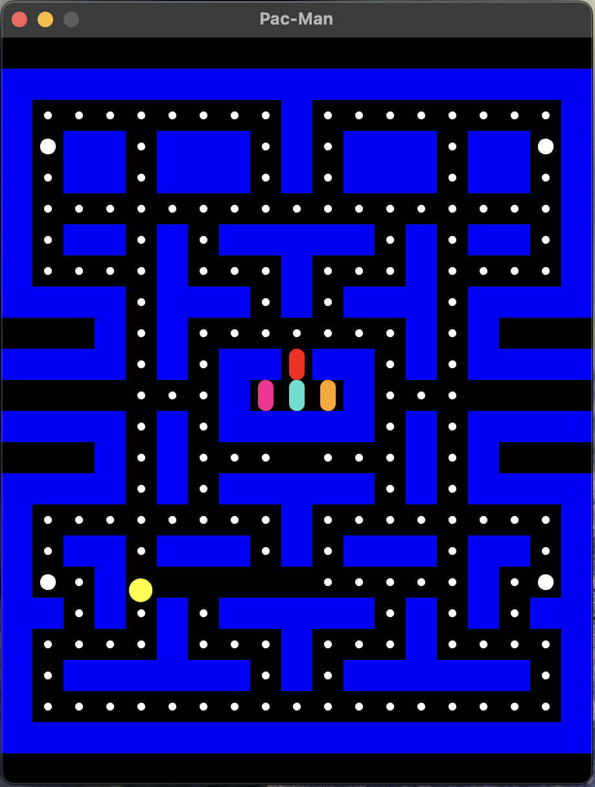

# Rust Pac-Man Clone

This project is a work in progress (WIP) clone of the classic arcade game Pac-Man, implemented in Rust. It utilizes the Bevy game engine for the ECS architecture and Rapier for the 2D physics.

<p align="center">
  
</p>

## Current Features

- Basic game state represented with a 2D grid
- Pac-Man controlls/movements
- Collision detection with the maze walls
- Collision pills

## Running the Game

Make sure you have [Rust installed](https://www.rust-lang.org/tools/install) in your system. After that, clone this repo, navigate to the project directory, and use Cargo to run the game:

```sh
git clone https://github.com/cyber-claws/rust-pacman.git
cd rust-pacman
cargo run
```

## TODO

- [ ] **Ghost Sprites**: Replace the current placeholders with actual sprites for the ghosts.
- [ ] **Pac-Man Sprites**: Implement different sprites for Pac-Man's various states (idle, eating, etc.).
- [ ] **Scoring System**: Implement a scoring system, where the player earns points for eating pellets and fruit, and for catching ghosts.
- [ ] **Ghost AI**: Refine the AI for the ghosts. Currently, they use a simple pathfinding algorithm, but this doesn't quite capture the behavior of the ghosts in the original game.
- [ ] **Sound Effects and Music**: Add sound effects for different game events (like eating a pellet or a ghost), and background music.
- [ ] **Game States**: Implement different game states (start screen, playing, game over, etc.).
- [ ] Compile for wasm

## License

This project is licensed under the MIT License. See the [LICENSE](./LICENSE) file for more details.